# 训练模型代码流程说明

本文档梳理当前日前电价预测系统的模型训练流程，覆盖从前端点击训练按钮、API 后台任务、历史数据读取、特征构造、分时段训练、多后端模型选择、滚动回测、模型版本落盘，到预测阶段如何使用当前模型。

## 1. 核心结论

当前训练逻辑可以概括为：

1. 前端提交训练参数到 `/api/train`。
2. 后端启动后台训练任务，解析页面参数并构造 `TrainConfig`。
3. 核心训练函数 `train_and_register()` 读取历史 Excel，进行缓存复用和数据质量检查。
4. 系统生成 96 点日内样本特征，并按训练窗口或日期范围筛选历史数据。
5. 按时段 `segment` 拆分样本，每个时段单独训练模型。
6. 对可用模型后端分别训练：`XGBoost`、`LightGBM`、`CatBoost`。
7. 每个候选模型用验证集评估，并按 `MAE + 0.2 * RMSE` 自动选择最优后端。
8. 可选执行最近 14 天和 30 天滚动回测。
9. 写入 `metadata.json`，将模型注册到 `models/current`，上一版移到 `models/previous`，历史版本保存到 `models/history/run_xxx`。
10. 预测时读取 `models/current/metadata.json`，使用 `selected_model_key` 指定的模型直接输出预测价格。

当前主模型是直接预测 `日前出清价格(元/MWh)`，相似法只作为预测参考曲线和回测对比，不再作为训练目标，也不再训练相似法残差。

## 2. 涉及的主要文件

| 文件 | 作用 |
|---|---|
| `frontend_app/assets/app.js` | 前端页面逻辑，负责收集训练参数、提交 `/api/train`、轮询任务状态 |
| `api_server.py` | HTTP API 服务，负责接收训练请求、创建后台任务、解析训练参数 |
| `dayahead_core.py` | 核心训练、预测、数据读取、特征构造、版本管理逻辑 |
| `dayahead_timeseg_model.py` | 命令行入口，支持 `train`、`predict`、`train_predict`、`runs`、`rollback` |
| `data_quality.py` | 历史数据和预测模板的数据质量检查 |
| `models/current/metadata.json` | 当前默认模型元数据 |
| `models/training_runs.jsonl` | 历史训练日志 |
| `models/window_optimization.json` | 自动训练窗口寻优状态 |

## 3. 端到端总流程图

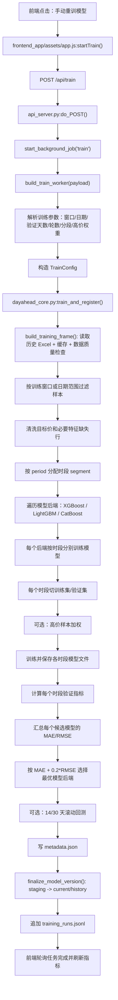

## 4. 前端入口流程

前端训练入口是 `frontend_app/assets/app.js` 中的 `startTrain()`。

它负责：

1. 读取训练模式。
2. 读取训练窗口天数或手动起止日期。
3. 读取验证集天数和训练轮数。
4. 读取高级训练参数，例如分段配置、高价样本加权。
5. 提交 `POST /api/train`。
6. 保存返回的 `job_id`。
7. 轮询后台任务，更新页面进度、日志和指标。

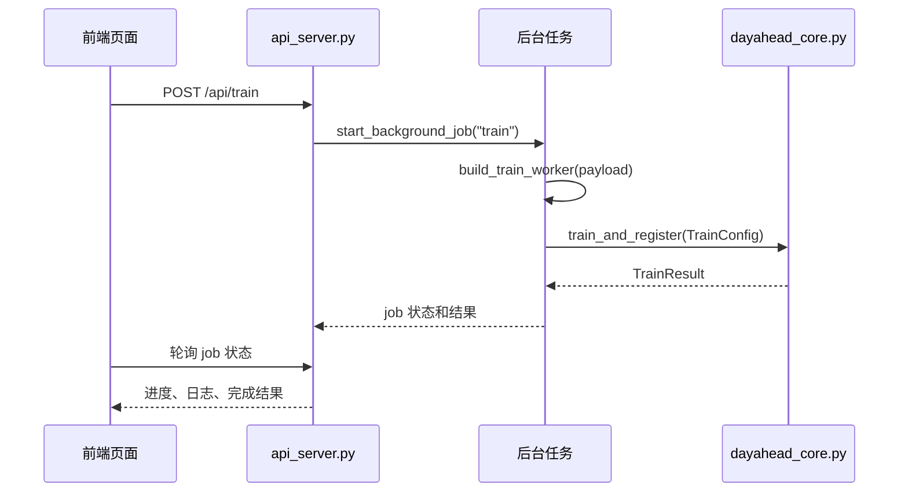

前端提交的典型参数包括：

| 参数 | 含义 |
|---|---|
| `training_mode` | 训练模式，滚动窗口或手动日期范围 |
| `training_window_days` | 滚动窗口模式下最近 N 天训练 |
| `start_date` | 手动训练起始日期 |
| `end_date` | 手动训练结束日期 |
| `enable_start` | 是否启用起始日期 |
| `enable_end` | 是否启用结束日期 |
| `valid_days` | 从样本末尾预留多少天做验证 |
| `num_boost_round` | 模型训练轮数 |
| `segment_config` | 自定义时段配置 |
| `high_price_weighting` | 高价样本加权配置 |

## 5. API 层训练任务流程

API 入口在 `api_server.py` 的 `do_POST()`。

当请求路径是 `/api/train` 时：

1. 读取 JSON 请求体。
2. 调用 `build_train_worker(payload)` 创建训练 worker。
3. 调用 `start_background_job("train", worker)` 启动后台线程。
4. 立即返回 `202 Accepted` 和 `job_id`。

后台 worker 的核心逻辑：

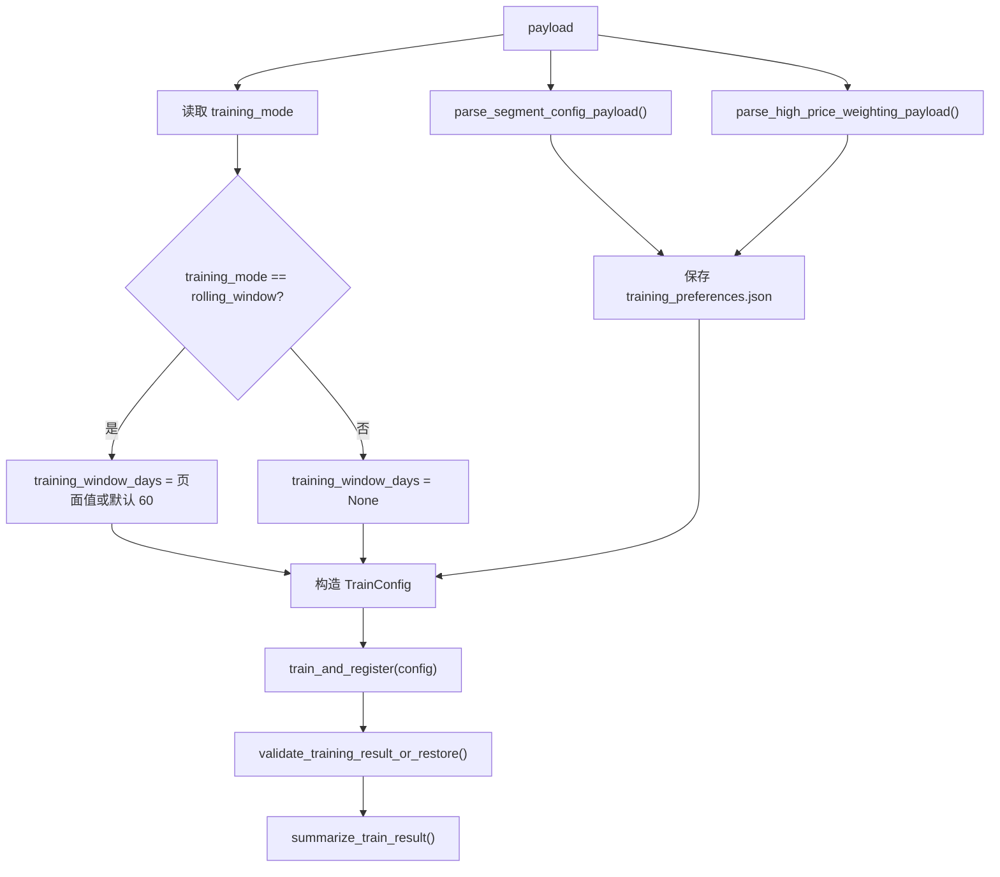

这里有一个保护逻辑：训练完成后会校验实际训练出来的模型配置是否和本次请求一致，如果发现分段或高价权重配置不一致，会尝试恢复之前的默认模型，避免错误模型覆盖当前模型。

## 6. 命令行训练入口

除了网页训练，也可以通过命令行训练。

入口文件是 `dayahead_timeseg_model.py`。

常见命令：

```powershell
python dayahead_timeseg_model.py train
python dayahead_timeseg_model.py train --training-window-days 60 --valid-days 14
python dayahead_timeseg_model.py train --start-date 2026-02-01 --end-date 2026-03-31
python dayahead_timeseg_model.py train --valid-days 14 --num-boost-round 500
```

命令行入口最终同样调用 `train_and_register()`，因此训练核心逻辑与网页训练一致。

## 7. 核心训练入口：train_and_register()

`dayahead_core.py` 中的 `train_and_register(config)` 是模型训练主流程。

主要阶段如下：

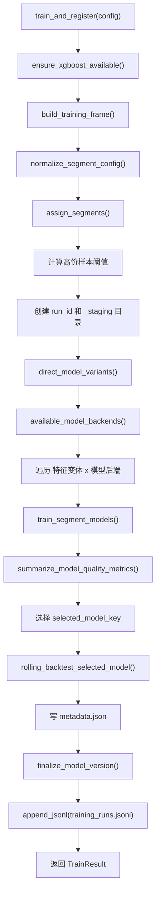

需要注意：

- 当前特征变体只有 `no_lag_96`。
- 当前系统会训练所有可用模型后端。
- 当前主目标是直接预测价格。
- 当前相似法只用于预测参考和回测对比。

## 8. 历史数据读取与缓存

训练样本通过 `build_training_frame()` 构造。

它内部会调用 `load_cached_history_collection()`，先判断是否能复用历史数据缓存。

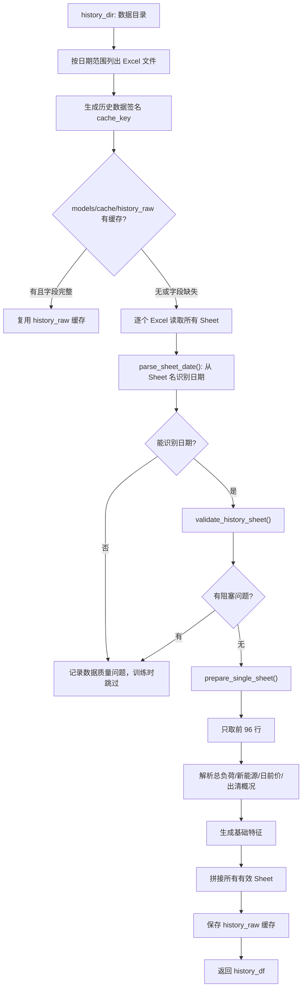

缓存设计的目的：

- 历史 Excel 没有变化时，不重复读取所有文件。
- 文件路径、大小、修改时间和日期范围变化时，缓存失效。
- 如果缓存缺字段，会自动重建缓存。

## 9. 单个 Sheet 如何转成训练样本

每个有效 Sheet 对应一天，系统只取前 96 行，即一天 96 个 15 分钟点。

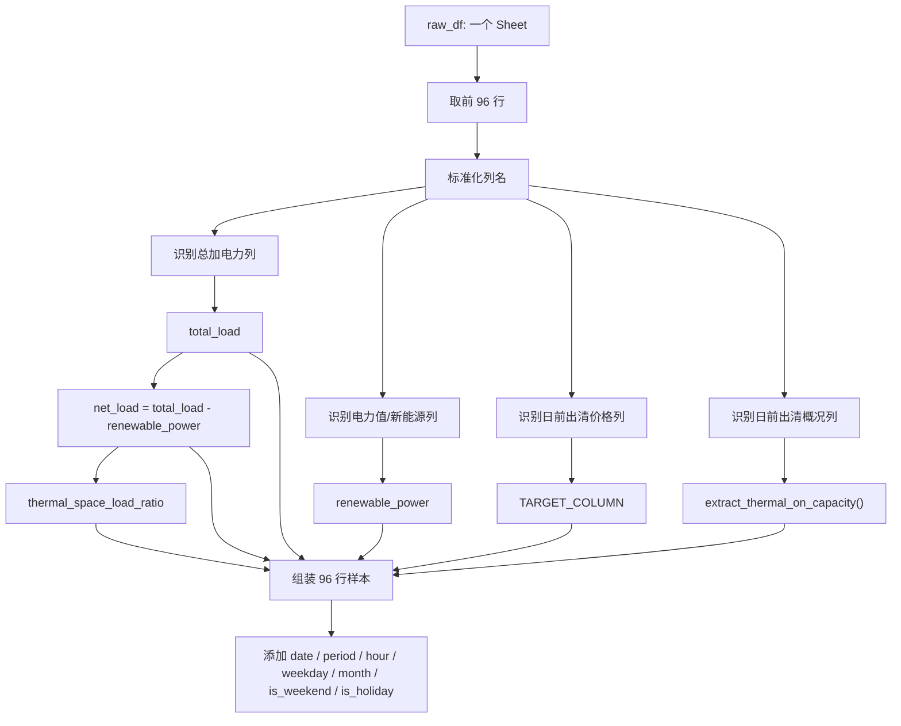

训练目标：

| 字段 | 说明 |
|---|---|
| `日前出清价格(元/MWh)` | 模型训练标签，即要预测的价格 |

训练特征：

| 特征 | 说明 |
|---|---|
| `total_load` | 总负荷 |
| `net_load` | 火电空间，通常为总负荷减新能源 |
| `renewable_power` | 新能源或电力值 |
| `thermal_space_load_ratio` | 火电空间负荷占比 |
| `thermal_on_capacity` | 火电开机容量 |
| `hour` | 小时 |
| `period` | 1~96 时段编号 |
| `weekday` | 星期几 |
| `month` | 月份 |
| `is_weekend` | 是否周末 |
| `is_holiday` | 是否节假日 |

## 10. 训练日期范围筛选

训练日期范围由 `resolve_training_date_range()` 决定。

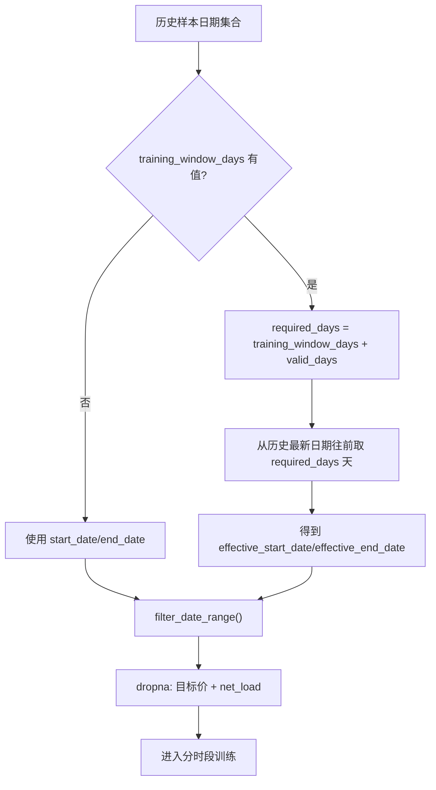

滚动窗口模式下，系统实际会取：

```text
训练窗口天数 + 验证集天数
```

例如：

- `training_window_days = 97`
- `valid_days = 14`

那么系统会从历史最新日期往前取 `111` 天，其中前 `97` 天用于训练，最后 `14` 天用于验证。

## 11. 训练集和验证集切分

切分逻辑在 `split_train_valid()`。

每个时段会独立切分训练集和验证集：

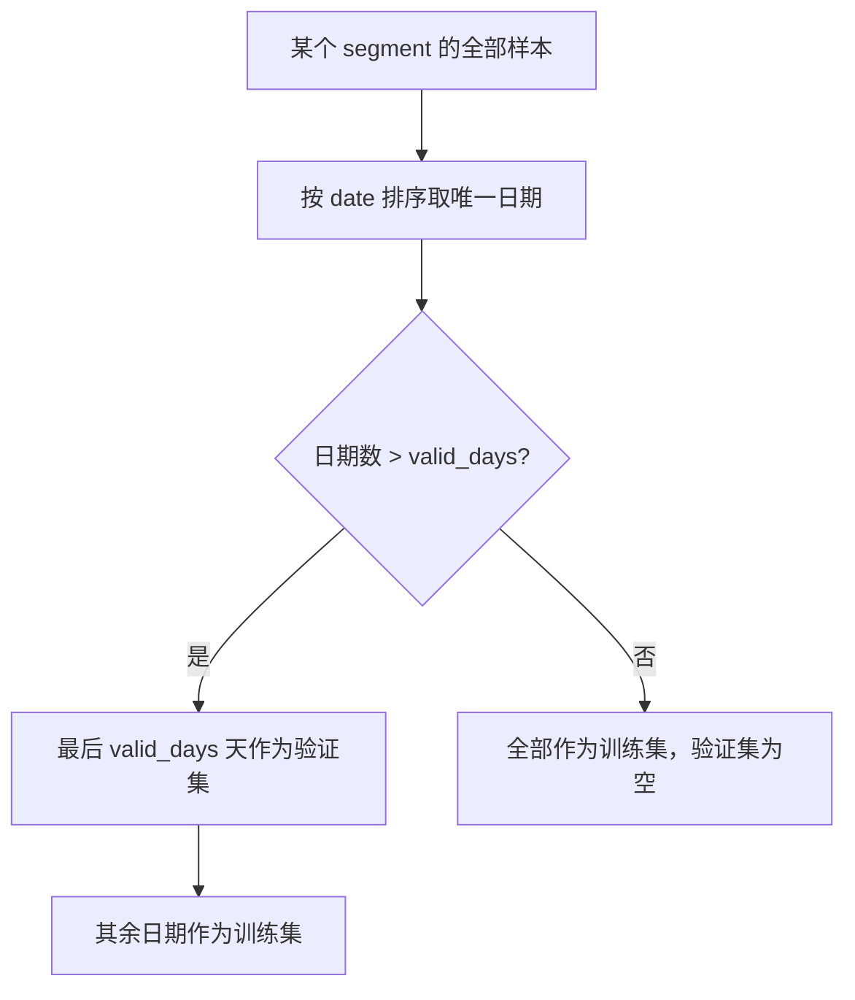

这样做的意义：

- 验证集一定来自时间序列末尾，更接近未来预测场景。
- 每个时段的验证指标单独计算，方便定位哪段表现差。

## 12. 分时段训练

系统会先根据 `period` 给每一行样本分配 `segment`。

默认分段在 `SEGMENTS` 中定义；如果前端传入自定义分段，则通过 `normalize_segment_config()` 校验并替换默认配置。

当前模型使用的是自定义 6 段：

| 时段 | period | 时间 |
|---|---:|---|
| `segment_1` | 1~20 | 00:00~05:00 |
| `segment_2` | 21~34 | 05:00~08:30 |
| `segment_3` | 35~66 | 08:30~16:30 |
| `segment_4` | 67~72 | 16:30~18:00 |
| `segment_5` | 73~86 | 18:00~21:30 |
| `segment_6` | 87~96 | 21:30~24:00 |

分时段训练流程：

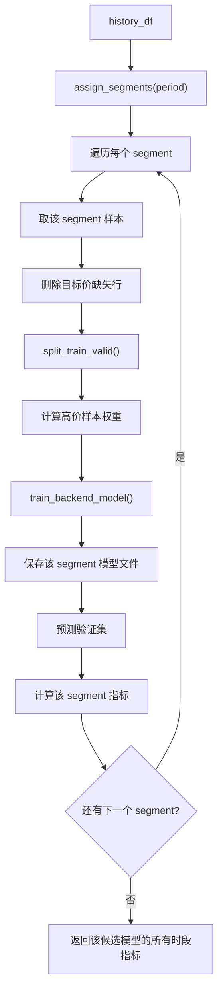

分时段建模的原因：

- 夜间、早高峰、午间、晚高峰的价格形成机制不同。
- 一个全日模型容易平均化，分段模型可以让每段学习自己的规律。
- 页面也能展示不同时间段的误差，便于诊断。

## 13. 高价样本加权

高价样本加权通过 `high_price_sample_weights()` 实现。

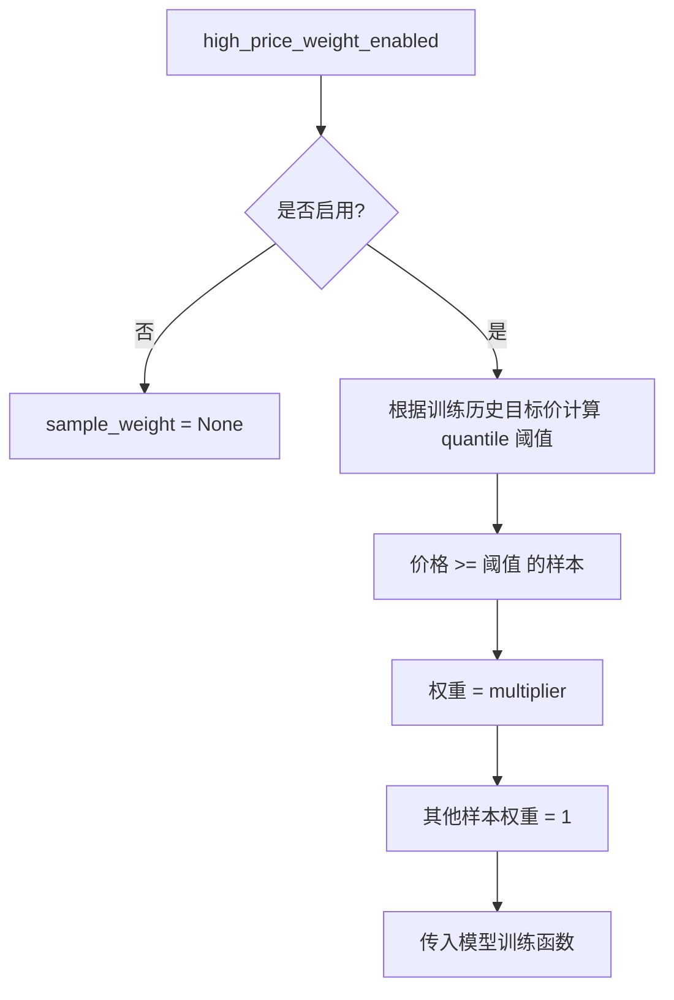

当前模型启用了高价样本加权：

| 参数 | 当前值 |
|---|---:|
| `enabled` | `true` |
| `quantile` | `0.8` |
| `multiplier` | `2.0` |
| `threshold` | `315.0` |

含义：

- 先找出历史价格的 80% 分位阈值。
- 价格大于等于该阈值的样本权重变为 2。
- 模型训练时会更重视高价样本，以改善尖峰价格预测。

## 14. 模型后端训练逻辑

当前候选模型后端：

| 后端 | 模型文件后缀 |
|---|---|
| XGBoost | `.json` |
| LightGBM | `.txt` |
| CatBoost | `.cbm` |

后端选择逻辑：

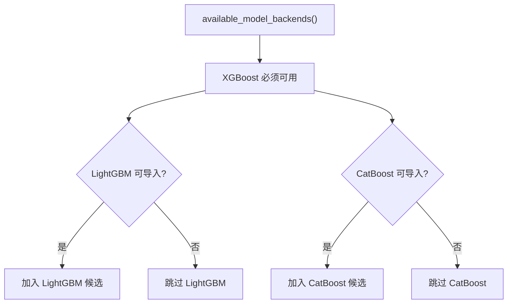

单个后端训练逻辑：

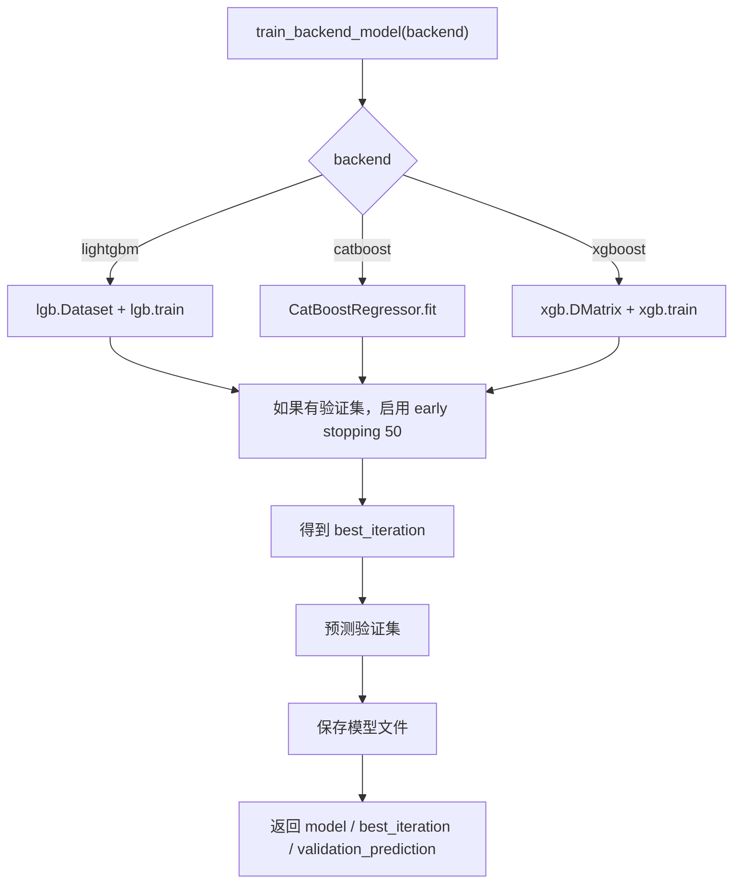

当前训练参数大体复用 `DEFAULT_XGB_PARAMS`：

| 参数 | 当前值 |
|---|---:|
| `objective` | `reg:squarederror` |
| `eval_metric` | `rmse` |
| `eta` | `0.05` |
| `max_depth` | `5` |
| `min_child_weight` | `3` |
| `subsample` | `0.85` |
| `colsample_bytree` | `0.85` |
| `seed` | `42` |

LightGBM 和 CatBoost 会把这些参数映射成各自后端的类似参数。

## 15. 候选模型训练矩阵

当前特征变体只有一个：

| 特征变体 | 含义 |
|---|---|
| `no_lag_96` | 不使用滞后价格特征，使用 96 点日内基础特征直接预测价格 |

如果三个后端都可用，则一次训练会得到：

```text
no_lag_96_xgboost
no_lag_96_lightgbm
no_lag_96_catboost
```

每个候选下面又包含每个时段一个模型：

```text
models/_staging/run_xxx/no_lag_96_xgboost/segment_1.json
models/_staging/run_xxx/no_lag_96_xgboost/segment_2.json
...
models/_staging/run_xxx/no_lag_96_lightgbm/segment_1.txt
...
models/_staging/run_xxx/no_lag_96_catboost/segment_1.cbm
...
```

也就是说，一次训练不是只训练一个模型，而是：

```text
候选后端数量 × 时段数量
```

如果是 3 个后端、6 个时段，则会训练 18 个分段模型。

## 16. 验证指标计算

每个时段会计算验证集预测指标：

| 指标 | 含义 |
|---|---|
| `train_rows` | 训练样本行数 |
| `valid_rows` | 验证样本行数 |
| `best_iteration` | early stopping 选出的最佳迭代轮数 |
| `high_price_train_rows` | 被高价加权的训练样本数 |
| `final_mae` | 验证集 MAE |
| `final_rmse` | 验证集 RMSE |
| `bias` | 平均偏差 |
| `max_abs_error` | 最大绝对误差 |
| `p90_abs_error` | 90 分位绝对误差 |
| `direction_accuracy` | 方向准确率 |
| `over_rate` | 高估比例 |
| `under_rate` | 低估比例 |

模型整体质量汇总时，会按 `valid_rows` 加权平均各时段的 MAE 和 RMSE。

## 17. 最优模型选择

系统会对每个候选模型计算整体指标，然后用以下分数选择最优后端：

```text
score = final_mae + 0.2 * final_rmse
```

流程：

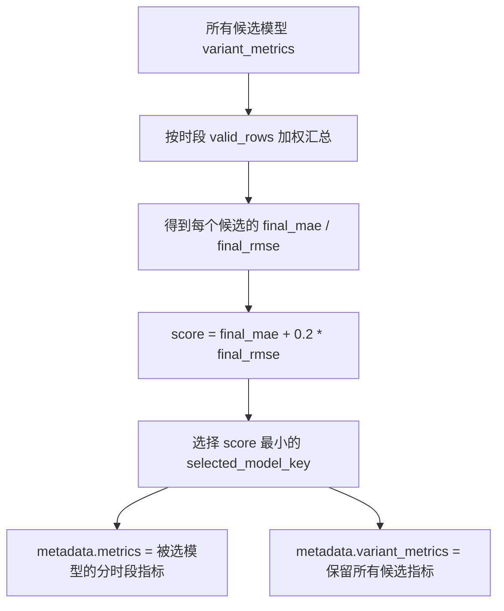

当前默认模型选中的是：

```text
selected_model_key = no_lag_96_catboost
selected_model_backend_label = CatBoost
```

这表示当前预测默认使用 CatBoost 后端训练出来的 6 个分段模型。

## 18. 滚动回测

如果 `enable_rolling_backtest=True`，训练后会运行 `rolling_backtest_selected_model()`。

它通常评估最近 14 天和 30 天。

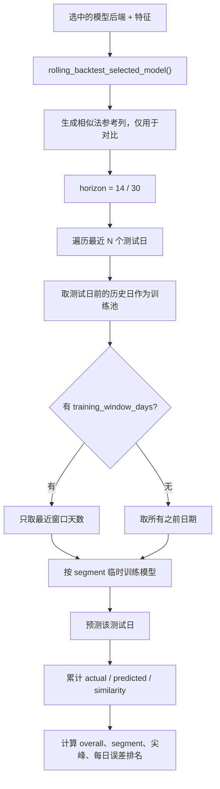

滚动回测输出包括：

- 总体误差。
- 分时段误差。
- 多条件相似法 baseline 误差。
- 仅火电空间相似法 baseline 误差。
- 模型相对 baseline 的改善幅度。
- 高价尖峰和低价样本误差。
- 每日误差最好和最差排行。

注意：滚动回测中的相似法只是对比参考，不参与当前主模型训练。

## 19. metadata.json 内容结构

训练完成后会写入 `metadata.json`。

关键字段：

| 字段 | 含义 |
|---|---|
| `run_id` | 本次训练版本号 |
| `created_at` | 创建时间 |
| `model_type` | 模型类型 |
| `target_column` | 训练目标列 |
| `feature_columns` | 当前选中模型使用的特征 |
| `model_variants` | 所有候选模型说明 |
| `selected_model_key` | 当前选中的候选模型 |
| `selected_model_backend` | 当前选中的后端 |
| `variant_quality_metrics` | 各候选模型整体验证指标 |
| `rolling_backtest_metrics` | 滚动回测指标 |
| `segments` | 分段定义 |
| `high_price_weighting` | 高价样本权重配置 |
| `valid_days` | 验证集天数 |
| `training_window_days` | 训练窗口天数 |
| `train_start_date` | 训练样本起始日期 |
| `train_end_date` | 训练样本结束日期 |
| `valid_dates` | 验证日期列表 |
| `sample_rows` | 清洗后的样本行数 |
| `skipped_sheets` | 被跳过的异常 Sheet |
| `metrics` | 当前选中模型的分时段指标 |
| `variant_metrics` | 所有候选模型的分时段指标 |

## 20. 模型版本注册与落盘

训练过程先写入 `_staging`，全部成功后才注册为正式模型。

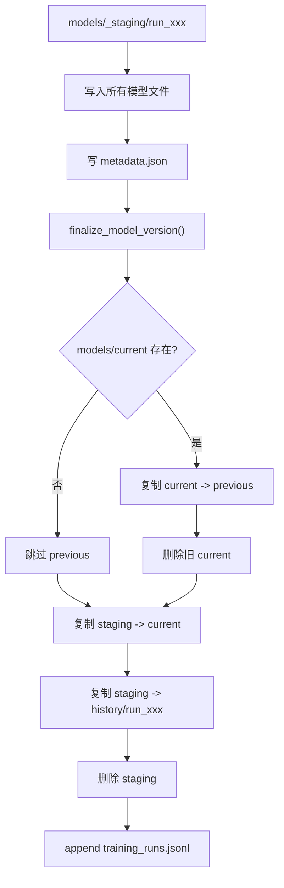

最终目录含义：

| 路径 | 含义 |
|---|---|
| `models/current` | 当前默认模型 |
| `models/previous` | 上一版模型 |
| `models/history/run_xxx` | 历史正式训练版本 |
| `models/_staging/run_xxx` | 训练中临时目录，成功后删除 |
| `models/training_runs.jsonl` | 训练日志 |

## 21. 手动训练窗口寻优

系统支持通过页面按钮手动寻找最优训练窗口，并在寻优完成后训练和启用最优模型。程序启动和状态刷新不会自动触发寻优。

入口在 `api_server.py` 的 `build_window_optimization_worker()`。

流程：

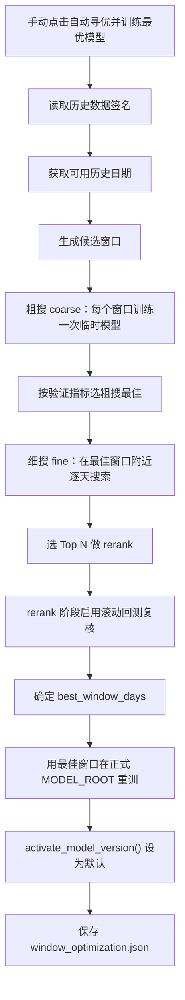

训练窗口寻优不会直接把每个候选窗口都覆盖到 `models/current`。

它会先在临时输出目录里训练候选模型，最后只把最佳窗口对应的正式训练结果启用为默认模型。

## 22. 预测阶段如何使用训练模型

预测时会加载当前默认模型：

1. 读取 `models/current/metadata.json`。
2. 读取 `selected_model_key`。
3. 加载该候选模型目录下的各时段模型。
4. 对预测模板构造同样的特征。
5. 按 `segment` 分组。
6. 每组用对应时段模型预测。
7. 当前新模型直接输出预测价格。
8. 相似法只生成参考价格和差值。

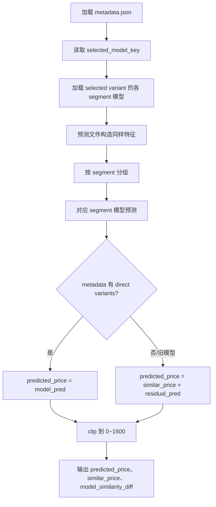

当前模型属于新格式 `direct_price_multi_model`，因此预测价格就是模型直接输出值。

## 23. 相似法在当前系统中的角色

当前系统里有两类相似法：

| 相似法 | 作用 |
|---|---|
| 多条件相似法 | 预测输出参考曲线、滚动回测 baseline |
| 仅火电空间相似法 | 额外参考曲线、滚动回测 baseline |

当前主模型训练不使用：

- `similar_price`
- `similar_gap`
- `residual_target`

因此：

```text
模型训练目标 = 日前出清价格
模型预测输出 = 预测日前出清价格
model_similarity_diff = 模型预测价格 - 相似法参考价格
```

`model_similarity_diff` 只是对比差值，不是训练残差。

## 24. 价格区间分类模型

价格区间分类模型与具体价格回归模型分开训练、分开评估，最终只在预测结果中合并展示。

训练时：

1. 系统读取训练中心保存的 `price_intervals` 配置。
2. 按真实日前价格生成区间标签，例如 `300-400` 或 `>1000`。
3. 复用当前价格模型的基础特征和分时段配置。
4. 训练 `interval_xgboost` 等区间分类候选模型。
5. 按区间命中率、Top2 命中率、概率质量和高价召回率选择最佳区间模型。
6. 将区间模型文件和 `price_interval_model` 元数据写入当前模型版本。

预测时：

1. 先执行原有具体价格预测。
2. 如果当前模型版本包含 `price_interval_model`，再加载区间分类模型。
3. 给每个时点追加 `predicted_interval`、`predicted_interval_probability`、`high_price_probability`、`interval_backtest_accuracy` 和 `price_interval_consistency`。
4. 如果当前模型没有区间模型，具体价格预测仍可正常运行。

## 25. 当前模型实际状态

当前 `models/current/metadata.json` 显示：

| 项目 | 当前值 |
|---|---|
| 当前模型 | `run_20260505_171518` |
| 创建时间 | `2026-05-05T17:19:34` |
| 模型类型 | `direct_price_multi_model` |
| 选中后端 | `CatBoost` |
| 选中模型键 | `no_lag_96_catboost` |
| 训练模式 | `rolling_window` |
| 训练窗口 | `97` 天 |
| 验证集 | `14` 天 |
| 训练日期 | `2026-01-02 ~ 2026-04-16` |
| 样本行数 | `10656` |
| 分段模式 | 自定义 6 段 |
| 高价加权 | 启用 |
| 高价阈值 | `315.0` |
| 高价权重倍数 | `2.0` |

## 26. 当前训练逻辑的关键特点

1. **直接价格模型**：训练目标是日前价格本身，不是相似法残差。
2. **分时段模型**：每个时段一套模型，降低全天统一建模的平均化问题。
3. **多后端自动比较**：XGBoost、LightGBM、CatBoost 可用时都会训练，再自动选择最优。
4. **时间序列验证**：验证集来自样本末尾，更贴近未来预测。
5. **高价样本加权**：可让模型更重视尖峰价格。
6. **滚动回测复核**：训练完成后可用最近 14/30 天滚动评估稳定性。
7. **版本可回退**：`current`、`previous`、`history` 三层结构支持回退和复盘。
8. **相似法退居参考**：相似法仍输出曲线，但不控制主模型预测结果。
